# STRANDS Chaos Engineering Agents 🔥

A multi-agent chaos engineering framework built on AWS Strands and Amazon Bedrock that intelligently analyzes workload resiliency through automated hypothesis generation, experiment design, and execution.

## Overview

Chaos Agent is an AI-powered chaos engineering platform that uses specialized agents to systematically test and improve the resilience of AWS workloads. The framework follows chaos engineering principles to generate intelligent hypotheses, design safe experiments, and execute controlled failure scenarios using AWS Fault Injection Service (FIS).

## Quick Start with Jupyter Notebook

The easiest way to get started is with our comprehensive Jupyter notebook that demonstrates the complete chaos engineering workflow:

### 📓 Main Workflow: `src/chaos_engineering_workflow.ipynb`

This notebook provides a complete end-to-end chaos engineering demonstration:

1. **🔬 Hypothesis Generation** - Analyzes the AWS Retail Store Sample App repository
2. **📊 Hypothesis Prioritization** - Intelligently ranks hypotheses by impact and feasibility
3. **🎯 Experiment Design** - Creates production-ready FIS experiment templates with validation
4. **🚀 FIS Setup** - Deploys experiments to AWS FIS with real resource discovery
5. **⚡ Experiment Execution** - Executes top priority experiments and monitors progress
6. **📈 Results Analysis** - Analyzes outcomes and generates actionable insights

#### Sample Workload
The notebook uses the [AWS Containers Retail Store Sample App](https://github.com/aws-containers/retail-store-sample-app) as a demonstration workload, covering:
- **Catalog Service** - Product browsing resilience
- **Cart Service** - Shopping cart persistence  
- **Orders Service** - Order processing reliability
- **Checkout Service** - Payment processing resilience
- **UI Service** - Frontend availability
- **Assets Service** - Static content delivery

> ⚠️ **Security Notice**: The retail store sample may deploy public-facing instances. Review security group configurations before deployment.

#### Deploying the EKS Version of the Retail Sample App
Note the EKS version of the APP is prefered for this example.

### Prerequisites

- AWS CLI configured with appropriate credentials
- Python 3.8+
- Node.js and npm (for CDK infrastructure)
- Access to Amazon Bedrock models
- Jupyter notebook environment
- kubectl (for EKS deployments)
- eksctl (for EKS cluster creation)

### Setup Steps

1. **Deploy Infrastructure**
   ```bash
   cd chaos-agent-infra
   npm install
   npm run build
   cdk deploy
   ```

2. **Install Dependencies**
   ```bash
   pip install -r requirements.txt
   ```

3. **Configure AWS Environment**
   Update the notebook with your AWS account details and region

4. **Run the Notebook**
   ```bash
   jupyter notebook src/chaos_engineering_workflow.ipynb
   ```

## Multi-Agent Architecture

The system consists of five specialized agents working together:

### 🧠 HypothesisGeneratorAgent
- **Purpose**: Analyzes AWS workloads and generates structured chaos engineering hypotheses
- **Capabilities**: 
  - Source code analysis and AWS resource discovery
  - Multi-service support (ECS, EKS, Lambda, EC2, RDS, etc.)
  - Covers all failure domains (compute, data, network, dependencies, resources)
  - Generates 20-100 comprehensive, testable hypotheses per workload
- **Output**: JSON-formatted hypotheses saved to database

### 📊 HypothesisPrioritizationAgent
- **Purpose**: Intelligently prioritizes chaos engineering hypotheses to maximize program value and safety
- **Capabilities**:
  - Adaptive prioritization framework development based on workload characteristics
  - Expert chaos engineering analysis and safety-first principles
  - Contextual awareness of AWS service patterns and dependencies
  - Assigns priority rankings from 1 to N with no gaps or duplicates
- **Output**: All hypotheses updated with intelligent priority rankings

### 🔬 ExperimentDesignAgent  
- **Purpose**: Converts hypotheses into production-ready AWS FIS experiment templates
- **Capabilities**:
  - Fetches live AWS FIS documentation for accuracy
  - Generates complete FIS templates with proper targeting
  - Applies safety-first approach with appropriate limits
  - Database integration for experiment tracking
- **Output**: Validated FIS experiment templates

### ⚡ ExperimentsAgent
- **Purpose**: Creates, executes, and manages FIS experiments in AWS
- **Capabilities**:
  - IAM role creation with strict AWS managed policy enforcement
  - AWS resource discovery and validation with real-time targeting
  - FIS experiment template creation and deployment
  - **Experiment execution and monitoring** with detailed progress tracking
  - **Results analysis and insights generation** from completed experiments
  - Database status updates throughout the experiment lifecycle
- **Output**: Executed experiments with comprehensive results and actionable insights

### 🔄 LearningAndIterationAgent
- **Purpose**: Analyzes experiment results to drive continuous improvement in system resilience
- **Capabilities**:
  - Deep analysis of experiment outcomes across multiple runs
  - Pattern recognition in failure modes and system responses
  - Correlation of resilience improvements with architectural changes
  - Generation of actionable recommendations for system hardening
  - Automated creation of follow-up hypotheses for further testing
  - Knowledge base development for resilience best practices
- **Output**: Comprehensive learning reports, system improvement recommendations, and refined hypotheses for future testing cycles

## Workflow

```mermaid
graph TD
    A[📓 Jupyter Notebook] --> B[🔬 Hypothesis Generation]
    B --> C[📊 Hypothesis Prioritization]
    C --> D[🎯 Experiment Design]
    D --> E[🚀 FIS Setup]
    E --> F[⚡ Experiment Execution]
    F --> G[📈 Results Analysis]
    G --> H[✅ Actionable Insights]
    
    B --> I[(Aurora Database)]
    C --> I
    D --> I
    E --> I
    F --> I
    G --> I
    
    J[🛒 Retail Store App] --> B
    K[📚 AWS FIS Docs] --> D
    L[🔐 IAM Roles] --> E
    M[☁️ AWS Resources] --> E
    N[📊 Monitoring] --> F
    O[🔍 Analysis] --> G
```



## Key Features

- **🤖 Multi-Agent Architecture**: Specialized agents for each phase of chaos engineering
- **📓 Notebook-Driven**: Complete workflow in an easy-to-follow Jupyter notebook
- **⚡ End-to-End Execution**: From hypothesis generation to experiment execution and results analysis
- **🔒 Safety-First Design**: Conservative targeting, limited blast radius, production-safe defaults
- **🏷️ Tag-Based Resource Filtering**: Optional workload tags to precisely target specific resources and avoid unrelated infrastructure
- **📊 Database Integration**: Aurora Serverless backend for experiment tracking and traceability
- **🔄 Hypothesis-Driven**: Links experiments back to specific hypotheses for validation
- **📚 Live Documentation**: Fetches current AWS documentation to ensure accuracy
- **🎯 Intelligent Targeting**: Analyzes hypotheses to determine appropriate failure scenarios
- **📈 Comprehensive Validation**: Multi-step validation before experiment execution
- **🔍 Results Analysis**: Automated analysis of experiment outcomes with actionable insights
- **🛡️ AWS Native**: Built for AWS services using FIS, IAM, and other AWS primitives
- **🔐 Strict IAM Enforcement**: Uses only approved AWS managed policies for security

## Infrastructure

### Database Schema
The Aurora Serverless database includes tables for:
- **system_component**: AWS resources and components
- **hypothesis**: Generated chaos engineering hypotheses  
- **experiment**: FIS experiment templates and configurations
- **monitoring_baseline**: Baseline metrics before experiments
- **experiment_result**: Results and observations from experiments

### CDK Infrastructure
Deploy the required Aurora Serverless database:
```bash
cd chaos-agent-infra
npm install && npm run build && cdk deploy
```

See `chaos-agent-infra/README.md` for detailed infrastructure setup.

## Tag-Based Resource Filtering

Chaos Agent supports optional workload tags to precisely target specific resources and avoid affecting unrelated infrastructure in your AWS account.

### How It Works

- **Optional by Design**: If no tags are provided, the system considers all discovered resources (current behavior)
- **Precise Targeting**: When tags are configured, only resources matching ALL specified tags are considered for experiments
- **Safety Enhancement**: Prevents accidental impact on unrelated resources in shared AWS accounts
- **Multi-Workload Support**: Different workloads can be distinguished by their unique tag combinations

### Usage Examples

**Command Line**:
```bash
# Target only production retail store resources
python src/run_workflow.py --tags "Environment=prod,Application=retail-store"

# Target staging environment for a specific team
python src/run_workflow.py --tags "Environment=staging,Team=platform"
```

**Workflow Orchestrator**:
```python
# Run workflow with tag filtering
result = run_chaos_workflow(
    workload_repo="https://github.com/your-org/app.git",
    tags="Environment=prod,Application=web-app",
    region="us-east-1"
)
```

**Agent Prompts**:
```
"Analyze the retail store application with tags Environment=prod and Application=retail-store"
```

### Supported Tag Formats

- **Comma-separated**: `"Environment=prod,Application=web-app"`
- **Space-separated**: `"Environment=prod Application=web-app"`
- **Colon separator**: `"Environment:prod,Application:web-app"`

### Tag Requirements

- Resources must have **ALL** specified tags to be considered
- Tag keys and values are case-sensitive
- Empty values are not allowed
- Maximum recommended: 2-3 tags for optimal performance

## Supported AWS Services

The framework supports chaos engineering for:
- **Compute**: ECS, EKS, Lambda, EC2, Auto Scaling
- **Storage**: S3, EBS, EFS
- **Database**: RDS, DynamoDB, Aurora
- **Networking**: ALB, NLB, VPC, Route 53
- **Serverless**: Lambda, API Gateway, Step Functions

## Advanced Usage

### Individual Agent Invocation

For advanced users who want to use the agents individually:

```python
# Import individual agents
from src.HypothesisGeneratorAgent.agent import agent as hypothesis_agent
from src.HypothesisPrioritizationAgent.agent import agent as prioritization_agent
from src.ExperimentDesignAgent.agent import agent as design_agent
from src.ExperimentsAgent.agent import agent as experiments_agent
from src.LearningAndIterationAgent.agent import agent as learning_agent

# Generate hypotheses
hypotheses = hypothesis_agent("Analyze workload and generate hypotheses")

# Prioritize hypotheses
priorities = prioritization_agent("Prioritize all hypotheses")

# Design experiments (focusing on highest priority hypotheses)
experiments = design_agent("Create FIS experiments for top priority hypotheses")

# Set up in AWS FIS
fis_setup = experiments_agent("Create FIS experiments from database")

# Analyze results and generate insights
insights = learning_agent("Analyze experiment results and generate improvement recommendations")
```

### Workflow Orchestration

For a more streamlined experience, use the workflow orchestrator which coordinates all agents:

```python
# Import the workflow orchestrator
from src.workflow_orchestrator import run_chaos_workflow

# Run the complete workflow with default settings
result = run_chaos_workflow()

# Run with custom parameters
result = run_chaos_workflow(
    workload_repo="https://github.com/your-org/your-app.git",
    region="us-east-1",
    top_experiments=5,
    verbose=True
)

# Access results from each step
hypotheses = result.outputs["hypotheses"]
insights = result.outputs["insights"]
```

### Command Line Interface

Run the workflow directly from the command line:

```bash
# Run with default settings
python src/run_workflow.py

# Run with custom parameters
python src/run_workflow.py --workload https://github.com/your-org/your-app.git --region us-east-1 --experiments 5 --verbose

# Run with workload tags for resource filtering
python src/run_workflow.py --tags "Environment=prod,Application=retail-store" --region us-east-1 --experiments 3
```

## Safety Guidelines

- **Limited Blast Radius**: Experiments target specific percentages or counts
- **Production-Safe**: Designed for gradual rollout and controlled testing
- **Read-Only Discovery**: Resource discovery uses only read operations
- **Conservative Defaults**: Safe targeting modes and stop conditions
- **Hypothesis Validation**: All experiments linked to specific hypotheses

## Configuration

### Default Model
Set the default model in `src/shared/config.py` by updating the `DEFAULT_MODEL` variable.

## Technology Stack

- **Framework**: AWS Strands Agents SDK
- **Models**: Amazon Bedrock (Claude 3.5 Sonnet default)
- **Database**: Amazon Aurora Serverless v2 (MySQL)
- **Chaos Engineering**: AWS Fault Injection Service (FIS)
- **Infrastructure**: AWS CDK (TypeScript)
- **Integration**: Model Context Protocol (MCP) servers
- **Interface**: Jupyter Notebook
- **Observability**: CloudWatch Logs with structured JSON logging

## Observability

The system includes comprehensive, host-agnostic observability with structured JSON logging that works across all deployment environments (ECS, EKS, Lambda, Docker, local development). All agent inputs, outputs, tool usage, and errors are automatically captured for prompt engineering and debugging.

Logs automatically flow to CloudWatch in ECS/Lambda, or can be collected by Fluent Bit/Fluentd in EKS environments.

## Project Structure

```
chaos-agent/
├── src/
│   ├── chaos_engineering_workflow.ipynb  # 📓 MAIN WORKFLOW NOTEBOOK
│   ├── workflow_orchestrator.py          # 🔄 Workflow pattern implementation
│   ├── run_workflow.py                   # 🚀 Command-line interface
│   ├── HypothesisGeneratorAgent/         # Workload analysis and hypothesis generation
│   ├── HypothesisPrioritizationAgent/    # Intelligent hypothesis prioritization
│   ├── ExperimentDesignAgent/            # FIS experiment template design
│   ├── ExperimentsAgent/                # FIS experiment creation and management
│   ├── LearningAndIterationAgent/       # Results analysis and continuous improvement
│   └── shared/                          # Common utilities and database connections
├── chaos-agent-infra/                  # CDK infrastructure for Aurora database
├── memorybank/                         # Project context and documentation
└── requirements.txt                    # Python dependencies
```

## Getting Started

1. **📓 Start with the Notebook**: Open `src/chaos_engineering_workflow.ipynb`
2. **🏗️ Deploy Infrastructure**: Follow the CDK setup in `chaos-agent-infra/`
3. **🛒 Deploy Sample App**: Use the retail store sample app as your test workload (ECS or EKS)
4. **🔬 Generate Hypotheses**: Let the agents analyze your workload
5. **🚀 Execute Experiments**: Run chaos tests through AWS FIS Console

## Contributing

1. **Extend Agent Capabilities**: Add support for new AWS services or failure modes
2. **Improve Safety**: Enhance targeting logic and safety validations
3. **Database Schema**: Extend schema for additional experiment metadata
4. **Documentation**: Update agent system prompts with new service examples
5. **Integration**: Add support for additional monitoring and alerting systems

## Related Projects

- [AWS Containers Retail Store Sample App](https://github.com/aws-containers/retail-store-sample-app) - Sample workload for testing
- [AWS Strands](https://github.com/awslabs/strands) - Multi-agent framework
- [AWS MCP Servers](https://github.com/awslabs/mcp) - Model Context Protocol tools

---

**⚠️ Important**: This framework creates AWS resources and may incur costs. Always review generated experiments before execution and test in non-production environments first.

**🚀 Ready to start?** Open the Jupyter notebook at `src/chaos_engineering_workflow.ipynb` and begin your chaos engineering journey!
