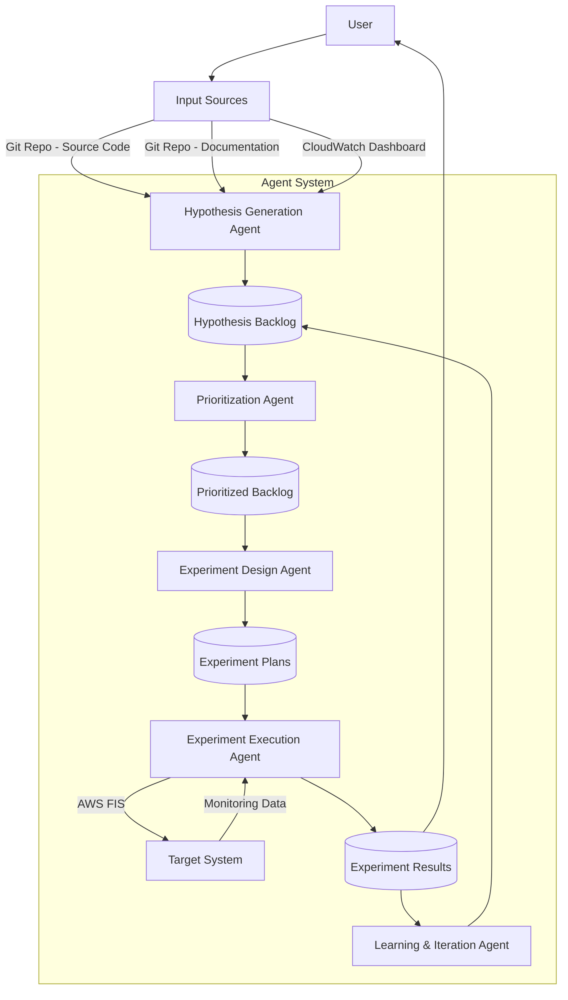

# System Patterns

## System Architecture

The Chaos Engineering Agent system follows a multi-agent architecture where specialized agents collaborate to implement a complete chaos engineering workflow. The system integrates with AWS services and user-provided resources to analyze, test, and improve system resilience.

## Key Technical Decisions

1. **Agent-Based Architecture**: Using specialized agents for different phases of the chaos engineering workflow allows for modularity, separation of concerns, and focused expertise in each area.

2. **AWS Strands Framework**: Leveraging AWS Strands for agent development provides a structured approach to building AI agents with access to tools and resources.

3. **Persistent Storage with Aurora Serverless**: Using Amazon Aurora Serverless for data storage provides a scalable, managed database solution for tracking experiment results and other data without requiring database administration.

4. **AWS FIS Integration**: Using AWS Fault Injection Service (FIS) for experiment execution provides a controlled, safe way to inject faults into AWS resources.

5. **CloudWatch Integration**: Using CloudWatch for monitoring system steady-state and experiment impacts leverages existing AWS monitoring capabilities.

## Design Patterns

1. **Pipeline Pattern**: The overall workflow follows a pipeline pattern, with each agent processing and transforming data before passing it to the next stage.

2. **Repository Pattern**: The hypothesis backlog and experiment results are stored in a central repository (Aurora Serverless) that can be accessed and modified by different agents.

3. **Observer Pattern**: The experiment execution agent observes the target system through CloudWatch to detect changes in system behavior during experiments.

4. **Strategy Pattern**: Different strategies can be employed for hypothesis generation, prioritization, and experiment design based on the system characteristics and user preferences.

5. **Facade Pattern**: The agents provide a simplified interface to complex chaos engineering concepts and AWS services.

## Component Relationships

1. **Hypothesis Generation Agent**:
   - Inputs: Git repositories (source code and documentation), CloudWatch dashboard
   - Outputs: Hypothesis backlog
   - Dependencies: Access to source code, documentation, and monitoring data

2. **Prioritization Agent**:
   - Inputs: Hypothesis backlog
   - Outputs: Prioritized hypothesis backlog
   - Dependencies: Hypothesis backlog data

3. **Experiment Design Agent**:
   - Inputs: Selected hypothesis from prioritized backlog
   - Outputs: Experiment plan
   - Dependencies: AWS FIS capabilities, target system architecture

4. **Experiment Execution Agent**:
   - Inputs: Experiment plan
   - Outputs: Experiment results
   - Dependencies: AWS FIS, CloudWatch, target system

5. **Learning & Iteration Agent**:
   - Inputs: Experiment results
   - Outputs: Updated hypothesis backlog
   - Dependencies: Experiment results, hypothesis backlog

## Critical Implementation Paths

1. **System Analysis Path**:
   - Source code repository access → Documentation repository access → CloudWatch dashboard access → System analysis → Hypothesis generation

2. **Experiment Execution Path**:
   - Hypothesis selection → Experiment design → AWS FIS configuration → Experiment execution → Result collection → Result analysis

3. **Learning Path**:
   - Experiment results → Hypothesis validation/invalidation → System understanding update → Hypothesis backlog update

4. **User Interaction Path**:
   - User request → Agent selection → Agent execution → Result presentation → User decision
